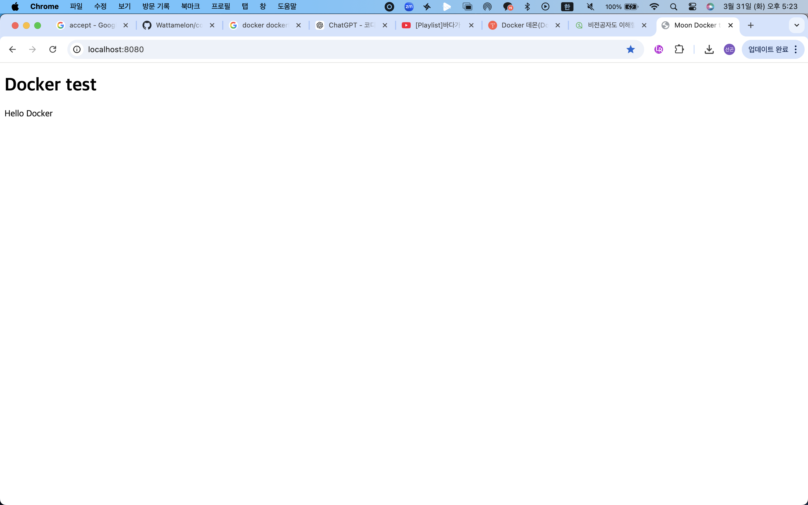
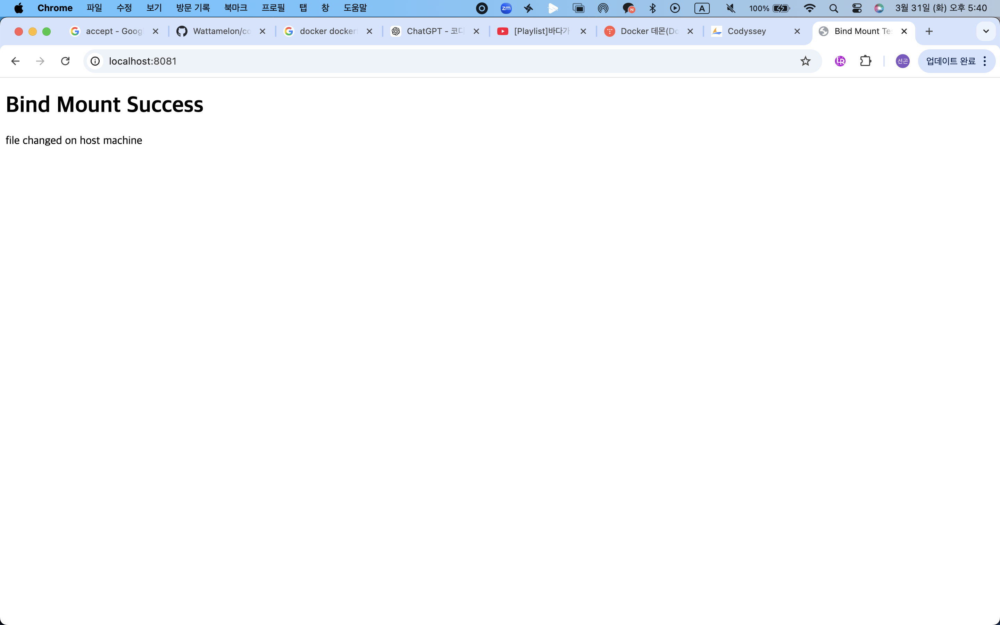
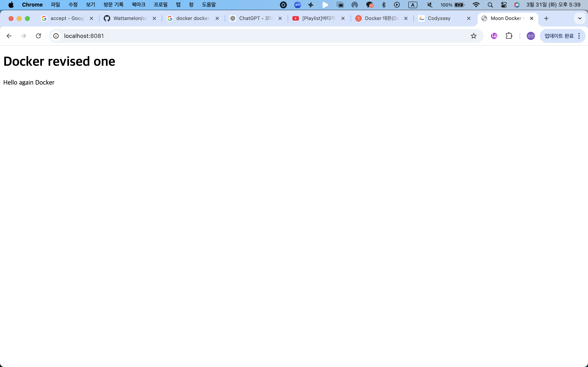

프로젝트 개요 : 도커 및 터미널을 이용한 워크스테이션 구축

실행 환경 : <br>
    1. OS : macOS Sonoma 14.4.1 <br>
    2. shell : zsh <br>
    3. 터미널 : vscode <br>
    4. Docker : 28.5.2 <br>
    5. git : git version 2.45.1 <br>

수행 항목 체크리스트 : ㅇ?

검증 방법 : txt 파일 참조 ? 뭐지 ? 

트러블슈팅 : 
    ### 트러블슈팅 1 - docker logs 실행 오류

    문제:
    ```bash
    docker logs
    ```

    에러:
    ```text
    docker: 'docker logs' requires 1 argument
    ```

    원인 가설:
    - docker logs 명령어는 특정 컨테이너의 로그를 확인하는 명령어이므로
    - 컨테이너 이름 또는 ID를 반드시 함께 입력해야 한다고 판단함

    확인:
    ```bash
    docker logs --help
    ```
    명령어를 통해 docker logs는 컨테이너를 지정해야 한다는 것을 확인함

    해결:
    - 실행 중인 컨테이너 목록을 확인한 후 로그 조회

    ```bash
    docker ps
    docker logs my-web
    ```

    결과:
    - 지정한 컨테이너의 로그가 정상적으로 출력됨

    정리:
    - docker logs는 단독 실행 불가능
    - 반드시 컨테이너 이름 또는 ID 필요

    ### 트러블슈팅 2 - GitHub push 거부됨

    문제:
    ```bash
    git push -u origin main
    ```

    에러:
    ```text
    ! [rejected] main -> main (fetch first)
    error: failed to push some refs
    ```

    원인 가설:
    - 원격 저장소에 로컬에 없는 커밋이 이미 존재함
    - GitHub 저장소 생성 시 README 등 초기 파일이 함께 생성되었을 가능성이 있음

    확인:
    ```bash
    git push -u origin main
    ```
    실행 시 원격 저장소에 기존 작업이 있어 push가 거부된다는 메시지를 확인함.

    해결:
    - 원격 저장소 내용을 유지할 필요가 없는 경우 강제 push 수행

    ```bash
    git push -u origin main --force
    ```

터미널 조작 로그 :
    pwd ,ls -a , mkdir , ls , cd , cp -r , mv , touch , rm , rmdir , vim , cat <br>
    [터미널 조작 로그 보기](docs/01_terminal_logs.md) <br>
    [권한실습 및 증거기록](docs/02_권한실습_및_증거기록.md)

Docker 운영 및 검증 로그 : 
    1. docker version , docker info
    2. dokcer images , docker ps -a , docker logs <br>
        [도커설치 및 기본점검](docs/03_Docker설치_및_기본점검.md) <br>
        [도커 기본운영 및 명령수행](docs/04_도커_기본운영_명령_수행.md)


Dockerfile 기반 웹 서버 컨테이너 :

    1. 웹 서버 소스코드 ( app/index.html )
    2. Dockerfile
    3. 빌드 및 실행 명령 결과 로그 
        
    4. 포트 매핑 접속 성공 증거 (스크린샷 또는 로그)<br>
        [컨테이너 실행 실습](docs/05_컨테이너_실행_실습.md) <br>
        [도커파일 기반 커스텀이미지](docs/06_도커파일기반_커스텀이미지제작.md)<br>


포트 매핑 접속 증거 :
    1. p <host_port>:<container> 실행 후.  주소창 포함 브라우저 접속 화면 (스크린샷 폴더)
     <br>
    [포트매핑 접속 증거](docs/07_포트매핑_접속증거.md)


바인드 마운트 반영 + 볼륨 영속성 증거 :
    1. 바인드 마운트 : 실행 명령 + 호스트 변경 전 후 비교

    
    <br>
    [바운드마운트 증거](docs/08_바운드마운트_증거.md)


    2. docker 볼륨 : 생성 , 연결 , 검증 명령 + 컨테이너 삭제 전 후. 비교
    (스크린샷 폴더)

Git 설정 및 Github / VSCode 연동 증거 : 
1. 깃 사용자 정보 , 기본 브랜치 설정 후 , vscode 에서 깃허브 로그인 및 저장소 연동 완료